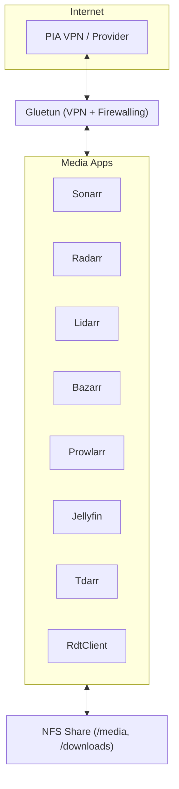

# 🎬 Media Suite


Automatização de um stack multimédia com Sonarr, Radarr, Lidarr, Prowlarr, Bazarr, Jellyfin, Tdarr e RdtClient, todos encapsulados atrás do Gluetun (VPN).

---

## 📋 Requisitos

- 🌐 Provedor VPN **suportado pelo [Gluetun](https://github.com/qdm12/gluetun)**
- ⚙️ Device `/dev/net/tun` disponível no host/LXC
- 📂 Acesso **NFS** configurado e permitido
- 👤 Permissões de NFS compatíveis com **UID/GID definidos no `.env`**

---

## 🚀 Passos de Instalação

```bash
# 1. Atualizar pacotes
sudo apt update

# 2. Instalar dependências
sudo apt install -y sudo git

# 3. Clonar o repositório
cd /opt
git clone https://github.com/lmbalcao/media-suite.git
cd media-suite
```
```bash
# 4. Preparar ficheiro de configuração
cp .env.example .env
nano .env   # editar com credenciais VPN e paths NFS
```
```bash
# 5. Correr o bootstrap
sudo ./bootstrap_media.sh
```

---

## 📡 Serviços e Portas

| Aplicação        | Porta | URL de acesso (local) |
| ---------------- | ----- | --------------------- |
| **Sonarr**       | 8989  | http\://<host>:8989   |
| **Radarr**       | 7878  | http\://<host>:7878   |
| **Lidarr**       | 8686  | http\://<host>:8686   |
| **Prowlarr**     | 9696  | http\://<host>:9696   |
| **Bazarr**       | 6767  | http\://<host>:6767   |
| **Jellyfin**     | 8096  | http\://<host>:8096   |
| **Tdarr WebUI**  | 8265  | http\://<host>:8265   |
| **Tdarr Server** | 8266  | http\://<host>:8266   |
| **RdtClient**    | 6500  | http\://<host>:6500   |

> ⚠️ Todos os serviços correm **atrás do Gluetun**.
> O acesso externo só funciona se as portas estiverem expostas no `docker-compose.yml`.

---

## 📂 Estrutura de Pastas

Durante a execução do **`bootstrap_media.sh`**, são criadas pastas dedicadas em `/opt` para guardar as configurações persistentes de cada aplicação:

```
/opt/
├── sonarr/       # Config Sonarr
├── radarr/       # Config Radarr
├── lidarr/       # Config Lidarr
├── prowlarr/     # Config Prowlarr
├── bazarr/       # Config Bazarr
├── jellyfin/     # Config Jellyfin
├── tdarr/        # Config Tdarr
│   ├── server/   # Binários e runtime
│   ├── configs/  # Definições e plugins
│   └── logs/     # Ficheiros de log
└── rdtclient/    # Config RdtClient
```

Além disso:

* As bibliotecas de **media** e **downloads** são montadas via **NFS** em:

  * `/mnt/media`
  * `/mnt/downloads`

---

### Mermaid (renderizado no GitHub)



---

## 📝 Notas

* O script `bootstrap_media.sh` valida automaticamente o `.env` antes de iniciar.
* Se o `.env` contiver valores com espaços (ex.: `private internet access`), o script interrompe a execução e pede correção.
* Após a execução, todos os serviços ficam disponíveis nas portas acima indicadas.

